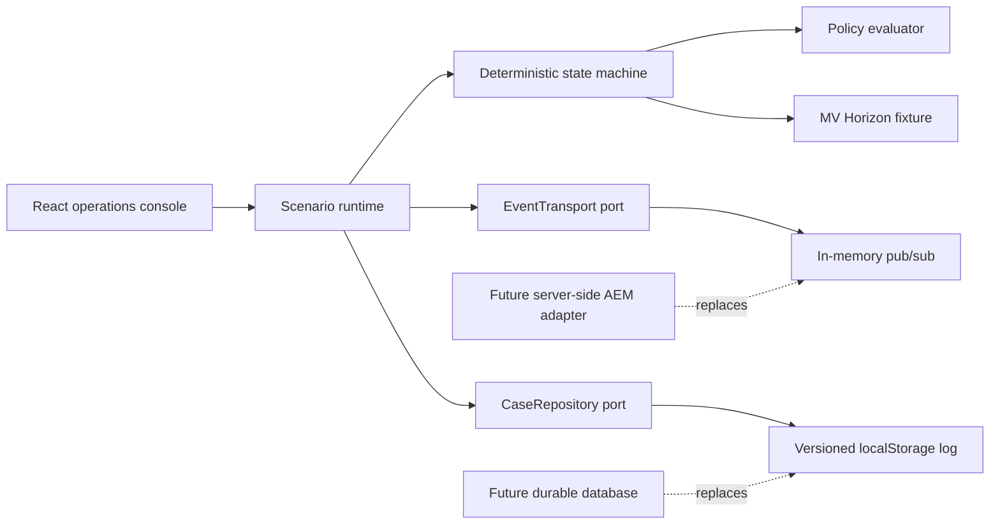

# SAP Agent Choreography

A customer-facing, interactive simulation of an event-driven supply-chain response coordinated through an SAP Advanced Event Mesh (AEM) architecture.

> **Simulation only:** this demo does not connect to live SAP, AEM, carrier, customer, or AI services. The agents are deterministic scenario services with transparent rules. No paid LLM API or credentials are required.

## What the demo shows

A 36-hour delay to the synthetic vessel **MV Horizon** starts a process without a human prompt:

1. **Signal** — carrier telemetry publishes a delay.
2. **Assess impact** — the Impact agent identifies three at-risk orders and `$67,500` in SLA exposure.
3. **Explore options** — Sourcing and Logistics independently propose mitigations from the same risk event.
4. **Decide** — the Supervisor evaluates three plans against margin, SLA, cost-to-serve, and customer-tier policy.
5. **Approve** — execution pauses at a durable human gate and survives a refresh.
6. **Execute and inform** — after approval, the app reroutes the shipment, updates orders, and notifies customers.

The first reroute attempt fails with a simulated expired carrier quote. The operator must explicitly retry it. A rejected plan never executes.

## Run locally

Prerequisites: Node.js 22.12+ and npm.

```bash
npm install
npm run dev
```

Open the URL printed by Vite.

### Quality commands

```bash
npm run lint
npm run typecheck
npm run test:run
npm run build
npm run test:e2e
```

To inspect the exact production bundle locally:

```bash
npm run build
npm run preview -- --host 127.0.0.1
```

The preview is served at `http://127.0.0.1:4173/sap-agent-choreography/` because the Vite base path matches this project’s GitHub Pages URL.

## Two-minute presenter walkthrough

1. Point out the **SIMULATED** badge and the difference between “AI answers questions” and “AI participates in the process.”
2. Select **Trigger vessel delay**. No user prompt is required to initiate the event.
3. Select **Play automatically**. The app assesses impact, runs the two proposal agents independently, and evaluates policy.
4. At the approval gate, refresh the page to demonstrate durable browser persistence.
5. Select **Approve plan** and resume. Execution begins only after the approval event.
6. When the carrier quote expires, select **Retry reroute**.
7. Let the scenario finish with the reroute booking, order update, and customer notifications.
8. Open any event in the fabric to inspect its correlation and causation metadata. Use **Replay delivery** to show that a duplicate event ID is ignored.
9. Reset and repeat through **Reject plan** to show the terminal no-execution branch.

## Architecture



The append-only event and command log is the canonical case state. The UI projection—stage status, agent output, approval state, execution state, and audit trail—is rebuilt from that log. Autoplay only dispatches the same `step` transition available to the presenter; timers do not contain business logic.

### Invariants

- One correlation ID spans the disruption case.
- Every envelope has a distinct event ID and inspectable causation chain.
- Sourcing and Logistics consume the same risk event and do not see one another’s proposals.
- The Supervisor cannot decide until both proposals exist.
- No reroute command can be emitted before durable approval, including after reload or replay.
- Rejection is terminal.
- Duplicate delivery cannot advance the case twice.
- Reset and replay are deterministic.

## Event sequence

```text
shipment.delay.detected.v1
order.risk.assessed.v1
sourcing.options.proposed.v1 + logistics.options.proposed.v1
remediation.plan.recommended.v1
remediation.plan.approval_requested.v1
remediation.plan.approved.v1 | remediation.plan.rejected.v1
command: logistics.reroute.requested.v1
logistics.reroute.failed.v1
command: logistics.reroute.requested.v1 (retry)
logistics.reroute.completed.v1
order.status.updated.v1
customer.notification.sent.v1
```

Every envelope contains `eventId`, `eventType`, `schemaVersion`, `occurredAt`, `correlationId`, `causationId`, `producer`, consumers, a conceptual topic, and a typed payload. Supervisor join events also retain both proposal IDs.

## Persistence and replay

The static Pages demo stores a small, versioned case record in browser `localStorage`. Data is validated on hydration; invalid or invariant-breaking logs are discarded. If browser storage is unavailable, the app falls back to session memory and displays a notice.

- **Replay log** rebuilds the projection from existing envelopes without creating new business events.
- **Replay delivery** republishes one envelope with its original event ID; the transport reports it as a duplicate and state does not advance.
- **Reset** removes the stored case and returns the scenario to idle.

Persistence is browser-local, not shared between viewers or devices.

## AEM production boundary

The browser implementation is behind explicit `EventTransport` and `CaseRepository` ports. A production deployment would move those responsibilities server-side:

- Replace in-memory transport with an authenticated AEM client.
- Map demo event names to project-owned topics such as `demo/supply-chain/shipment/delay/detected/v1`; keep commands under a separate command namespace. These are demo conventions, not claimed SAP-standard event names.
- Create durable queue subscriptions for independently scaling Impact, Sourcing, Logistics, Supervisor, approval, and execution consumers.
- Acknowledge messages only after durable append and successful handler completion.
- Enforce `eventId` uniqueness in durable storage for idempotency.
- Carry case, correlation, causation, and schema metadata in the canonical envelope and appropriate broker properties.
- Use bounded retry/backoff and a dead-message queue for poison or exhausted deliveries.
- Keep AEM endpoint, VPN, OAuth, credentials, and certificates on the server. Never expose them through `VITE_*` variables.
- Replace `localStorage` with PostgreSQL, HANA, or another durable operational store and expose the case through an authenticated API or event stream.

Illustrative labels including SAP TM, SAP S/4HANA, SAP Datasphere, SAP Ariba, SAP Integration Suite, Joule/mobile approval, and carrier/3PL APIs are conceptual integration points only.

## Connected Solace + AWS demo

The public app retains local mode, and can also read `public/runtime-config.json` to enable a shared phone session. The connected architecture follows the SAP integration journey: an illustrative S/4HANA Enterprise Event Enablement signal is guardrailed by the orchestrator, published through Solace, and fans out to independent Sourcing, Logistics, and Customer/SLA workers. A Supervisor joins their results before requesting mobile approval.

AWS is intentionally small and serverless: API Gateway HTTP API, four low-concurrency Lambda workers, DynamoDB on-demand storage with four-hour TTL, Secrets Manager, X-Ray, and a monthly $20 AWS Budget. API throttling, reserved Lambda concurrency, and a hard quota of 1,000 new sessions per month bound usage; the AWS Budget remains an alert rather than a forced shutdown. At normal demo traffic the expected spend is under $2/month, excluding any separately billed Solace service.

```bash
# AWS SSO must already be active; defaults to ca-central-1
npm run deploy:cloud
```

The command deploys the stack and updates `public/runtime-config.json` with the API URL. Rebuild and deploy Pages afterward so the browser enables connected mode.

To activate Solace publishing, export the broker and SEMP values locally and run:

```bash
export SOLACE_SEMP_URL=...
export SOLACE_VPN=...
export SOLACE_SEMP_USERNAME=...
export SOLACE_SEMP_PASSWORD=...
export SOLACE_REST_URL=...
export SOLACE_USERNAME=...
export SOLACE_PASSWORD=...
npm run configure:solace
```

The provisioning script creates durable queues for Sourcing, Logistics, Customer/SLA, and audit subscriptions, then writes runtime messaging credentials to AWS Secrets Manager. Never commit these values. If the Solace secret is not configured, cloud sessions use direct concurrent Lambda invocation as an explicit fallback so the phone demo remains testable.

To delete the AWS resources:

```bash
npm run destroy:cloud
```

## Deployment

[`.github/workflows/pages.yml`](.github/workflows/pages.yml) verifies the app and deploys `dist/` through GitHub’s official Pages artifact workflow on pushes to `main` or manual dispatches. Repository Pages must use **GitHub Actions** as its build source.

Public site: <https://solacese.github.io/sap-agent-choreography/>

## Limitations

- The public demo has no server process, shared database, external event broker, real approval identity, or live SAP integration.
- Scenario IDs, timestamps, customers, orders, and financial figures are fictional and deterministic.
- “Reasoning” panels explain programmed rules; they do not represent hidden model reasoning or an LLM decision.
